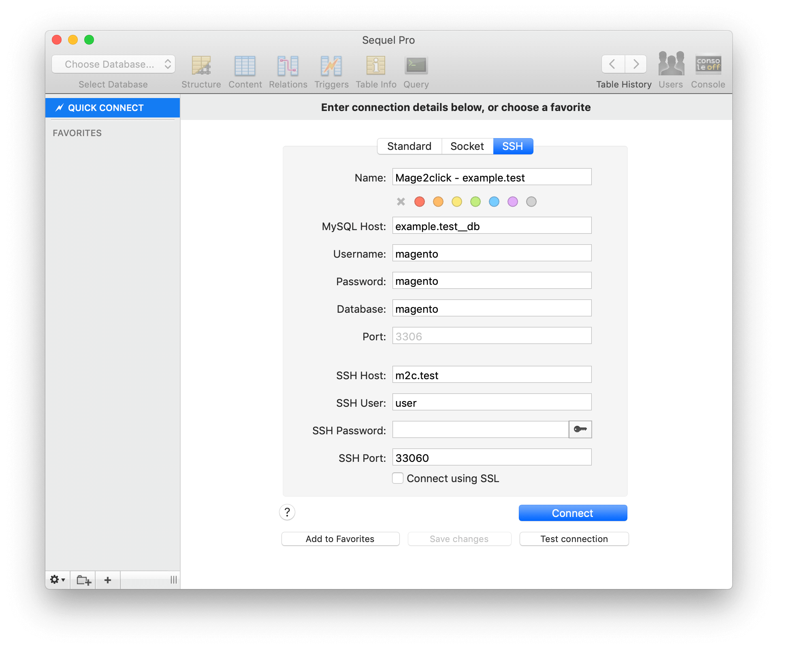
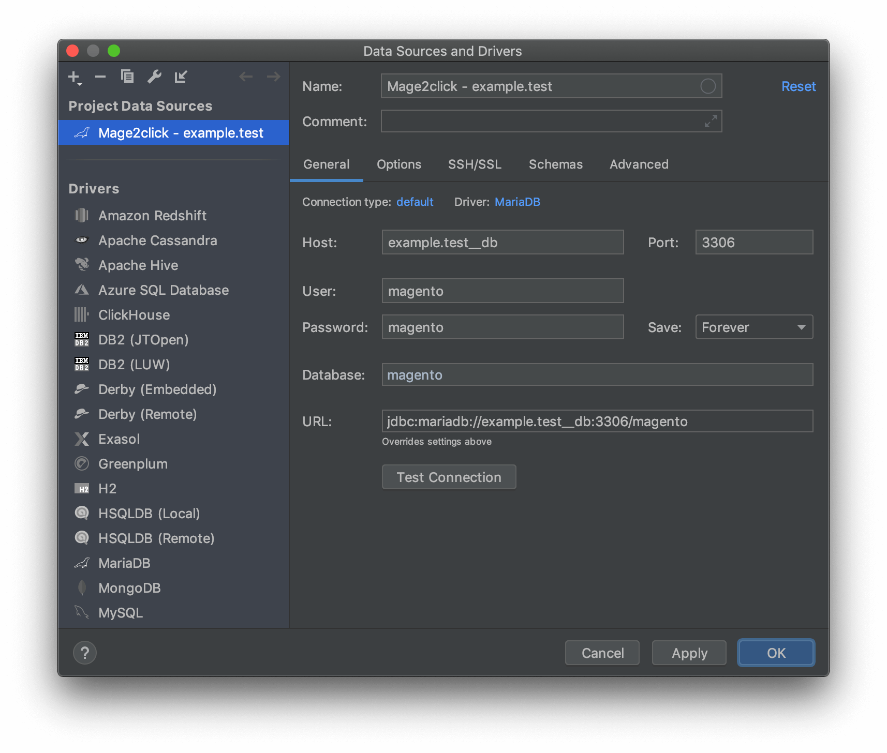

Emma2Click toolset supports connection to the mysql database in 2 ways:

## Accessing database with phpMyAdmin

If you have added phpMyAdmin service during project initialization, simply open https://pma.example.test where example must be replaced with the domain name used on your m2c backed project. If you haven't added phpMyAdmin, you can add phpMyAdmin service to your existing m2c backed project with the command below.

```bash
m2c add phpmyadmin
```

## Accessing database via SSH tunnel

It is possible to access the database directly by using the SSH tunnel.

Default access credentials like database name, user and password are all magento. Mysql host is the domain name of your project suffixed with __db, for example, example.test__db. SSH tunnel credentials are m2c.test as host, user as username with an empty password, and port 33060.

Bellow, you can check configuration examples for popular database management applications.

### Sequel Pro

Open the SSH section in the database connection screen. The SSH password field must remain empty.

<p align="center"></p>

### PHP storm

General and SSH/SSL tabs must be configured. The proxy password field must remain empty.

<p align="center"></p>

<p align="center"></p>

### Navicat