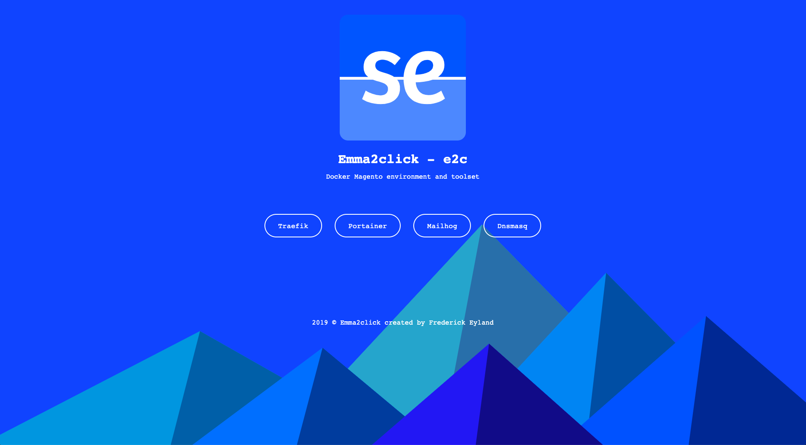
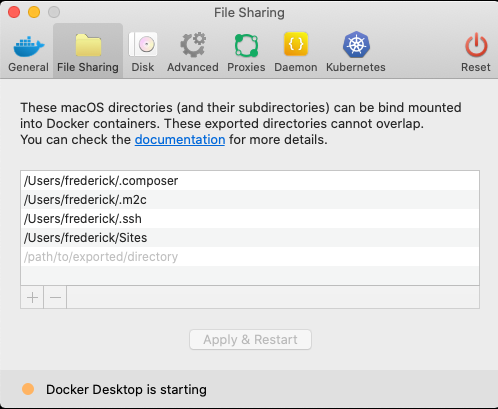

# Emma2click Docker Magento <br><small>environment and toolset</small>

<p align="center"></p>

<p align="center">
  <a href="https://github.com/magento/magento2" target="_blank"></a>
</p>

Emma2click toolset is a system-wide command-line tool for creating and managing simultaneously running docker Magento projects with insanely easy installation and configuration. It includes plenty of configurable services and useful commands for developing and project orchestration right out of the box. On macOS systems, [mutagen.io](https://mutagen.io) tool will be bundled in the toolset for high-performance files sync between host and docker containers.

## Table of contents

- [Prerequisites](#prerequisites)
- [Installation](#installation)
- [What is included](#what-is-included)
    - [Global system-wide services](#global-system-wide-services)
    - [Per-project services](#per-project-services)
- [Usage](#usage)
    - [Interactive project initialization mode](#interactive-project-initialization-mode)
    - [Commandline project initialization mode](#commandline-project-initialization-mode)
- [XDEBUG](XDEBUG.md)
- [E2C COMMAND LIST](E2CCOMMANDS.md)
- [Database connection](DATABASE.md)
- [Linux info](LINUX.md)
- [Performance issues](#performance-issues)
- [Remarks](#Remarks)
- [License](#license)

## Prerequisites

This setup assumes you are running Docker on a computer with at least 6GB of allocated RAM, a dual-core, and an SSD hard drive.

This configuration has been tested on macOS and  Ubuntu.

## Installation

To install Emma2click toolset to your system, simply run command below.

```bash
curl -sL -H 'Cache-Control: no-cache' https://raw.githubusercontent.com/freeyland/e2c/master/get | bash
```

## What is included

### Global system-wide services

After toolset is installed, you will have the next tools available locally:

- Traefik - <a href="https://traefik.e2c.test" target="_blank">https://traefik.e2c.test</a>
- Portainer - <a href="https://portainer.e2c.test" target="_blank">https://portainer.e2c.test</a>
- Mailhog - <a href="https://mailhog.e2c.test" target="_blank">https://mailhog.e2c.test</a>
- Dnsmasq - <a href="https://dnsmasq.e2c.test" target="_blank">https://dnsmasq.e2c.test</a>

Toolset local homepage with links to all tools listed above is available at: <a href="https://e2c.test" target="_blank">https://e2c.test</a>

<p align="center"></p>

- **Traefik:** An open-source reverse proxy and load balancer for HTTP and TCP-based applications that is easy, dynamic, automatic, fast, full-featured, production proven, provides metrics, and integrates with every major cluster technology... 

- **Portainer:** it’s a powerful, open-source management toolset that allows you to easily build, manage and maintain Docker environments.

- **Mailhog:** MailHog is an email testing tool for developers:
  - Configure your application to use MailHog for SMTP delivery
  - View messages in the web UI, or retrieve them with the JSON API
  - Optionally release messages to real SMTP servers for delivery

- **DNSMasq:** is a lightweight, easy to configure, DNS forwarder and DHCP server. It is designed to provide DNS and optionally, DHCP, to a small network. It can serve the names of local machines which are not in the global DNS. The DHCP server integrates with the DNS server and allows machines with DHCP-allocated addresses to appear in the DNS with names configured either in each host or in a central configuration file. Dnsmasq supports static and dynamic DHCP leases and BOOTP/TFTP for network booting of diskless machines.

**All docker images with services listed above must be active.** These services are configured to start automatically and should not be stopped. Without active Traefik and Dnsmasq, e2c backed projects can't work properly. This option can be disabled with:

> e2c global autostart off

### Per-project services

Most of services are available with version on your choice.

All docker Magento projects initialized with:

- Nginx
- PHP-FPM
- MariaDB
- Redis
- Xdebug

And optionally available:

- Varnish
- Elasticsearch
- phpMyadmin
- RabbitMQ

The optionally available containers can be added on the fly with ```e2c add ...```

## Usage

After toolset is installed on your system, you may use it to initialize new or existing magento projects.

To get a list of all commands and usage information, run ```e2c``` or ```e2c --help``` which is equivalent.

See [E2C COMMAND LIST](E2CCOMMANDS.md) for a full overview of available commands.

### Interactive project initialization mode (existing and new)

To initialize project, open the desired directory with terminal and run

```bash
e2c init
```

This command will launch project initialization in interactive mode.
***This is for both existing and new projects!***
Simply follow the steps to configure the desired Docker Magento development environment. You will be guided through a wizard.

When asked for a Magento edition you have 3 options:

1. CE: community edition, installed via composer
2. EE: enterprise edition, installed via composer
3. DE: community edition, downloaded from http://pubfiles.nexcess.net/magento/ce-packages/

Both CE and EE will install Studioemma/optimus theme and the composer package freeyland/magento2-replaces. This will disable [some core modules](https://github.com/freeyland/magento_replaces).

<p align="center"></p>

***Note that for Linux users, your local uid and gid will be requested. e2c will automatically fill them in by using id -u and id -g. This is because the files on you host and in docker should have the same access rights.

### Commandline project initialization mode

If at least one command argument is defined, automated setup will be started. All undefined parameters will be set with default values.

```bash
e2c init [parameters...] [flags...]
```

To get a list of all available parameters and flags for project configuration, run 

```bash
e2c init --help
e2c db --help
```

## XDEBUG

[XDEBUG info](XDEBUG.md)

## CONNECTING TO A DATABASE

[DATABASE info](DATABASE.md)

## Linux info

[Ubuntu DNS changes](LINUX.md)

## Command list

[E2C COMMAND LIST](E2CCOMMANDS.md)

## Performance issues

https://markshust.com/2018/01/30/performance-tuning-docker-mac/

<p align="center"></p>

## Remarks and issues

### Uninstall

Please note that when you uninstall, the containers will be removed. So when having issues with e2c it is better to reinstall than to do an uninstall. Reinstall can be triggered by running the curl command again from above.

### Change of domain name

When changing the domainname of your project, you will need to recreate your containers ans ALSO remove env.php.

### When doing e2c down

The containers will be deleted and the persistant volumes will be removed. Note they are not deleted from your system! You can delete them via portainer.

### When importing a db

Use the absolute path to your file!

### What folders are not synced

        * .idea
        * .vscode
        * .m2c
        * /bin
        * /generated
        * /pub/media/catalog/product
        * /pub/static
        * /var
        * /vendor
        * /node_modules

### Linux socket issue => debug help

Inside php container as root.

```bash
e2c bash --root
#Check the errors of output:
/usr/local/bin/docker-php-entrypoint   php-fpm --nodeamonize
```

## License

[MIT](https://github.com/mage2click/m2c/blob/master/LICENSE)

This project is based on https://github.com/mage2click/m2c and has some specific changes for internal use.