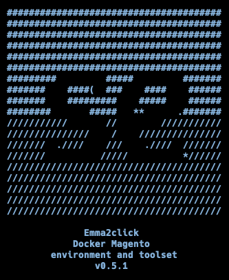

# Emma2click Docker Magento <br><small>environment and toolset</small>

<p align="center"></p>

<p align="center">
  <a href="https://github.com/magento/magento2" target="_blank"></a>
  
</p>

Emma2click toolset is a system-wide command-line tool for creating and managing simultaneously running docker Magento projects with insanely easy installation and configuration. It includes plenty of configurable services and useful commands for developing and project orchestration right out of the box. On macOS systems, [mutagen.io](https://mutagen.io) tool will be bundled in the toolset for high-performance files sync between host and docker containers.

## Table of contents

- [Prerequisites](#prerequisites)
- [Installation](#installation)
- [What is included](#what-is-included)
    - [Global system-wide services](#global-system-wide-services)
    - [Per-project services](#per-project-services)
- [Usage](#usage)
    - [Interactive project initialization mode](#interactive-project-initialization-mode)
    - [Commandline project initialization mode](#commandline-project-initialization-mode)
- [License](#license)

## Prerequisites

This setup assumes you are running Docker on a computer with at least 6GB of allocated RAM, a dual-core, and an SSD hard drive. 
 
This configuration has been tested on macOS. Linux based systems still require testing. Any testing are welcomed!

## Installation

To install Emma2click toolset to your system, simply run command below.

```bash
curl -sL https://raw.githubusercontent.com/freeyland/e2c/master/get | bash
```

## What is included

### Global system-wide services 

After toolset is installed, you will have the next tools available locally:

- Traefik - <a href="https://traefik.e2c.test" target="_blank">https://traefik.e2c.test</a>
- Portainer - <a href="https://portainer.e2c.test" target="_blank">https://portainer.e2c.test</a>
- Mailhog - <a href="https://mailhog.e2c.test" target="_blank">https://mailhog.e2c.test</a>
- Dnsmasq - <a href="https://dnsmasq.e2c.test" target="_blank">https://dnsmasq.e2c.test</a>

Toolset local homepage with links to all tools listed above - <a href="https://e2c.test" target="_blank">https://e2c.test</a>

**All docker images with services listed above must be active.** These services are configured to start automatically and should not be stopped. Without active Traefik and Dnsmasq, e2c backed projects can't work properly.  

### Per-project services

Most of services are available with version on your choice.

All docker Magento projects initialized with: 

- Nginx
- PHP-FPM
- MariaDB
- Redis
- Xdebug

And optionally available:

- Varnish
- Elasticsearch
- phpMyadmin
- RabbitMQ 

## Usage

After toolset is installed on your system, you may use it to initialize new or existing magento projects.

To get a list of all commands and usage information, run ```e2c``` or ```e2c --help``` which is equivalent.

### Interactive project initialization mode (existing and new)

To initialize project, open the desired directory with terminal and run

```bash
e2c init
```

This command will launch project initialization in interactive mode. Simply follow the steps to configure the desired Docker Magento development environment.

### Commandline project initialization mode

If at least one command argument is defined, automated setup will be started. All undefined parameters will be set with default values.

```bash
e2c init [parameters...] [flags...]
```

To get a list of all available parameters and flags for project configuration, run 

```bash
e2c init --help
e2c db --help
```

## PhpMyadmin

You can access phpmyadmin page by surfing to http://pma.[E2C_CFG_DOMAIN_NAME]

## License

[MIT](LICENSE)