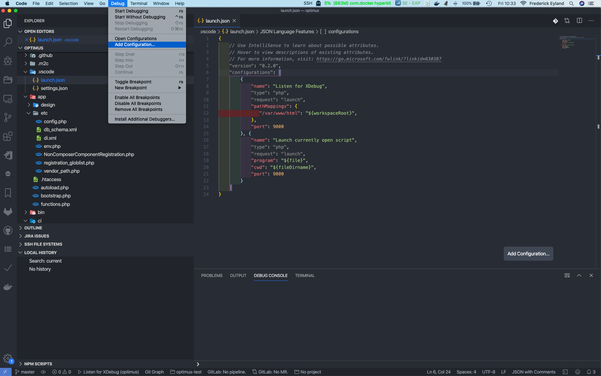
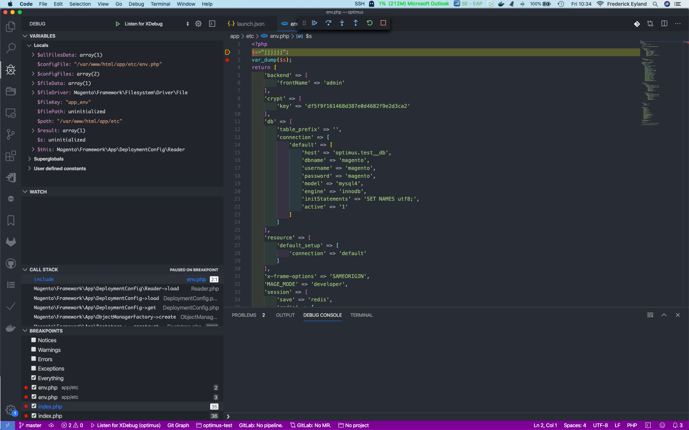

Emma2Click toolset supports Magento debugging with Xdebug out of the box. Only a few configuration steps are required.

## Configuration for PHPStorm IDE

Open **Servers** preferences section.

```
Preferences | Languages & Frameworks | PHP | Servers
```

Add the new server to match your project and configure path mappings. Your project directory must be mapped to `/var/www/html` path. Don't forget to press `Apply` or `OK` button. Check the screenshot below as reference.


After that, go to the **PHP** preferences section.

```
Preferences | Languages & Frameworks | PHP
```

Select **PHP language level** to match PHP version used in your Magento project.

For **CLI Interpreter**, click on three dots to add new one. A new **CLI Interpreters** dialog box will appear, press on plus (+) sign and choose `From Docker, Vagrant, VM, Remote...`


In the appeared dialog box, select `Docker` and for **Image name** choose emma2click xdebug Docker image with corresponding PHP version to your Magento project, for example `emma2click/e2c:php-fpm-7.2-xdebug-alpine`. Press `OK`.

Also, press `OK` on **CLI Interpreters** dialogue box.


Make sure that newly created **CLI Interpreter** is selected and press `OK` on **PHP** preferences section.


## Configuration for vscode IDE

Click on debug -> add configuration.
This will create a launch.json file under .vscode



Add following content to file:

```YAML
"configurations": [
        {
            "name": "Listen for XDebug",
            "type": "php",
            "request": "launch",
            "pathMappings": {
               "/var/www/html": "${workspaceRoot}",
            },
            "port": 9000
        }, {
            "name": "Launch currently open script",
            "type": "php",
            "request": "launch",
            "program": "${file}",
            "cwd": "${fileDirname}",
            "port": 9000
        }
    ]
```

## Usage

### PHP storm

To start/stop debugging, press `Start/Stop Listening for PHP Debug Connections` button.


### VSCODE

To start/stop debugging, press play button.


### BROWSER

On the browser side, you will need to set `XDEBUG_SESSION` cookie to activate Xdebug or simply use **Xdebug Helper** browser extension for that.

